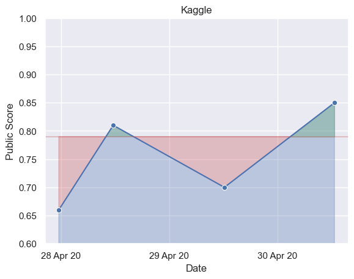

Kaggle Graph
====================

|license| |version| |docs|

.. |license| image:: https://img.shields.io/github/license/OliverSieweke/kaggle-graph
    :target: https://choosealicense.com/licenses/mit
    :alt: License: MIT
.. |version| image:: https://img.shields.io/github/v/tag/OliverSieweke/kaggle-graph
    :target: https://github.com/OliverSieweke/kaggle-graph/releases
    :alt: Versions
.. |docs| image:: https://readthedocs.org/projects/kaggle-graph/badge/?version=latest
    :target: https://kaggle-graph.readthedocs.io/en/latest/?badge=latest
    :alt: Documentation Status

GitHub action to automatically generate graphs of your submissions to Kaggle
competitions and display them in your Github repository’s ``README`` to track
your progress.

See it in action `here`_.

.. getting_started

Getting Started
---------------

1. Add the :code:`KAGGLE_KEY` secret to your GitHub repository under
   ``Settings > Secrets > Add a new secret``.

2. Define a GitHub workflow_ by adding a ``.github/workflow/kaggle-graph.yaml``
   to your repository using the template below:

.. code:: yaml

    name: Kaggle Graph Generation

    on:
      push:
        branches: master
      schedule:
        - cron:  '00 00 * * *'

    jobs:
      build:
        runs-on: ubuntu-latest
        steps:
          - name: Git Checkout
            uses: actions/checkout@v2
          - name: Kaggle Graph Generation
            uses: OliverSieweke/kaggle-graph@v0.1.0
            with:
              KAGGLE_KEY: ${{ secrets.KAGGLE_KEY }}
              KAGGLE_USERNAME: oliversieweke
              KAGGLE_COMPETITION_ID: titanic
          - name: Git Auto Commit
            uses: stefanzweifel/git-auto-commit-action@v4.1.6
            with:
              commit_message: Automatic Kaggle graph generation

3. Add the graph to your ``README``:

  - Markdown:
      .. code:: md

        [!Kaggle Submissions Graph](./kaggle-submissions-graph.png)
  - reStructuredText:
      .. code:: rst

        .. image:: ./kaggle-submissions-graph.png
            :alt: Kaggle Submissions Graph

.. before_notes

**NB 1:**
  - The :code:`KAGGLE_KEY` key can be generated on Kaggle_ under ``My Profile
    > Edit Profile > API > Create New Api Token``.
  - The :code:`KAGGLE_USERNAME` can be found on Kaggle_ under ``My Profile > Edit
    Profile``.
  - The :code:`KAGGLE_COMPETITION_ID` can be read from the Kaggle_ competition's URL.

**NB 2:**
  **Kaggle Graph** is designed to be used in conjunction with the following
  GitHub actions:

    - checkout_
    - git-auto-commit_

.. after_notes

Configurations
--------------

The action can be further configured over the input keys below:

+-------------------------------+--------------------------+-----------+------------------------------------+---------------------------------------------------------+
| Name                          | Description              | Required  | Default                            | Type                                                    |
+===============================+==========================+===========+====================================+=========================================================+
| :code:`KAGGLE_USERNAME`       | Kaggle username.         | ``true``  | ``-``                              | :code:`str`                                             |
+-------------------------------+--------------------------+-----------+------------------------------------+---------------------------------------------------------+
| :code:`KAGGLE_KEY`            | Kaggle key.              | ``true``  | ``-``                              | :code:`str`                                             |
+-------------------------------+--------------------------+-----------+------------------------------------+---------------------------------------------------------+
| :code:`KAGGLE_COMPETITION_ID` | Kaggle competition ID.   | ``true``  | ``-``                              | :code:`str`                                             |
+-------------------------------+--------------------------+-----------+------------------------------------+---------------------------------------------------------+
| :code:`GRAPH_NAME`            | Output graph file name.  | ``false`` | :code:`"kaggle-submissions-graph"` | :code:`str`                                             |
+-------------------------------+--------------------------+-----------+------------------------------------+---------------------------------------------------------+
| :code:`Y_MIN`                 | Y-axis minimum boundary. | ``false`` | ``-``                              | :code:`float`                                           |
+-------------------------------+--------------------------+-----------+------------------------------------+---------------------------------------------------------+
| :code:`Y_MAX`                 | Y-axis maximum boundary. | ``false`` | ``-``                              | :code:`float`                                           |
+-------------------------------+--------------------------+-----------+------------------------------------+---------------------------------------------------------+
| :code:`SCORE`                 | Score type.              | ``false`` | :code:`positive`                   | :code:`str` (:code:`positive` or :code:`negative`)      |
+-------------------------------+--------------------------+-----------+------------------------------------+---------------------------------------------------------+
| :code:`OBJECTIVE`             | Score objective.         | ``false`` | ``-``                              | :code:`float`                                           |
+-------------------------------+--------------------------+-----------+------------------------------------+---------------------------------------------------------+

.. _here: https://github.com/OliverSieweke/bike-sharing-demand
.. _.github/workflow/kaggle-graph.yaml: ./workflow.template.yaml
.. _Kaggle: https://www.kaggle.com/
.. _workflow: https://help.github.com/en/actions/reference/workflow-syntax-for-github-actions
.. _checkout: https://github.com/actions/checkout
.. _git-auto-commit: https://github.com/stefanzweifel/git-auto-commit-action

.. before_references

References
----------

- Documentation_

.. _Documentation: https://kaggle-graph.readthedocs.io/en/latest/?badge=latest
