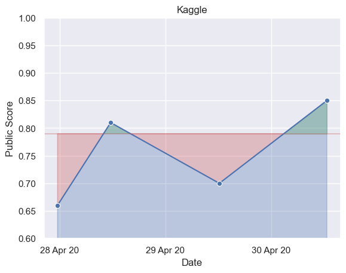

Kaggle Graph
============

GitHub action to automatically generate graphs of your submissions to Kaggle competitions and display them in your Github repository's ``README`` to track your progress.

.. toctree::
   :maxdepth: 2

   user_guide
   developer_guide
